# Decent

A Better Alternative.

We use the issues on this repo to track bugs, glitches & feature requests.

Below is the light & Dark Version of each UI Element (Version 0.0.8):

<h2>Splash Screen</h2>

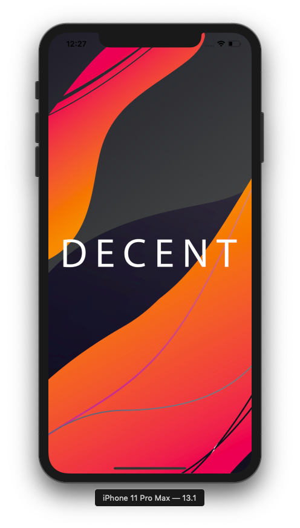

 

<h2>Sign Up</h2>

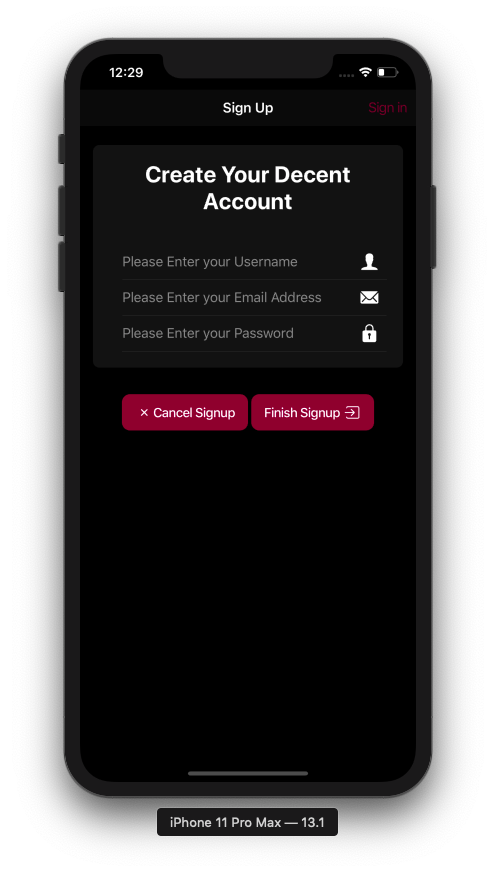
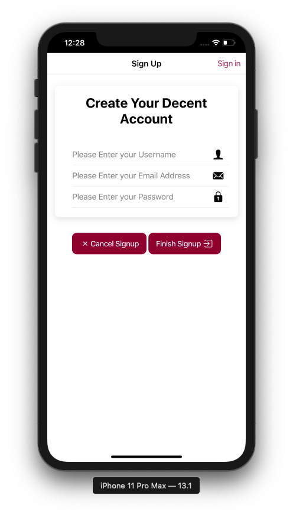
 

<h2>Login</h2>

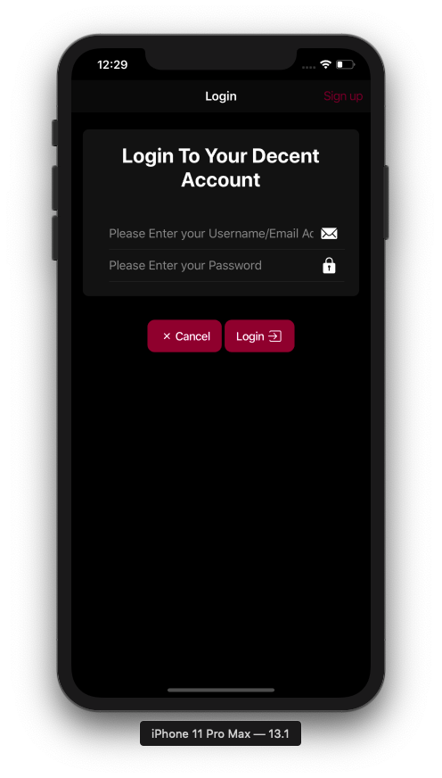
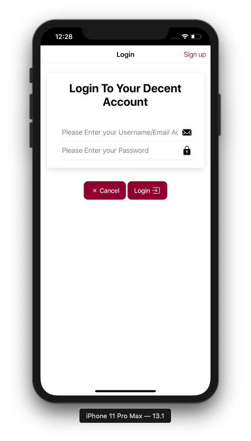
 

<h2>Main Interface</h2>

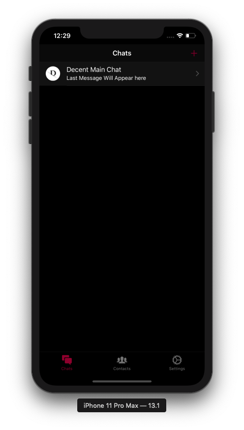
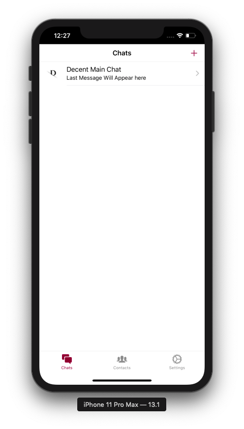
 

<h2>Chat UI</h2>

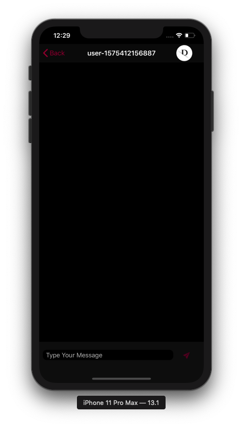
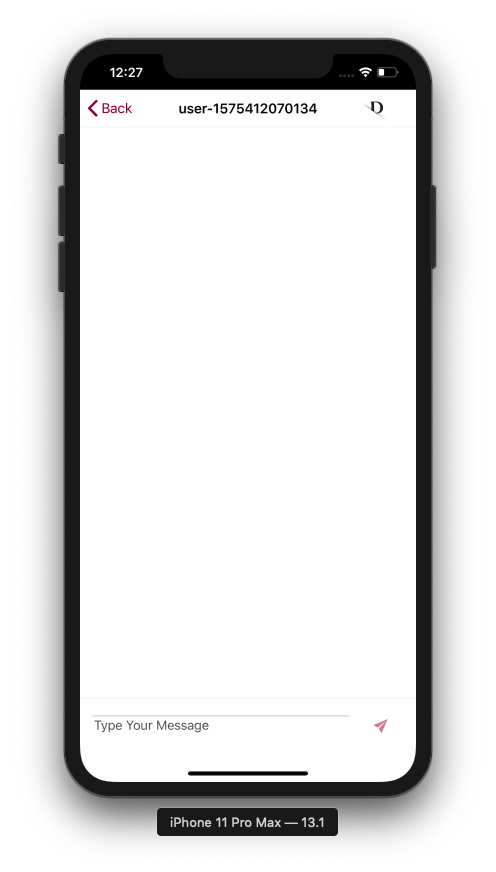
 

<h2>New Chat</h2>

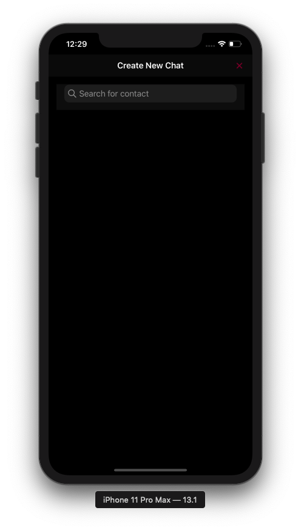
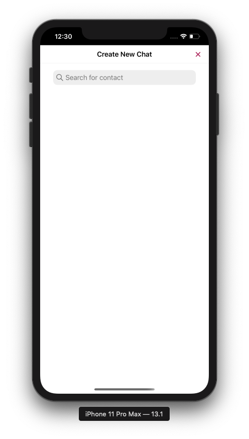
 

<h2>Settings</h2>

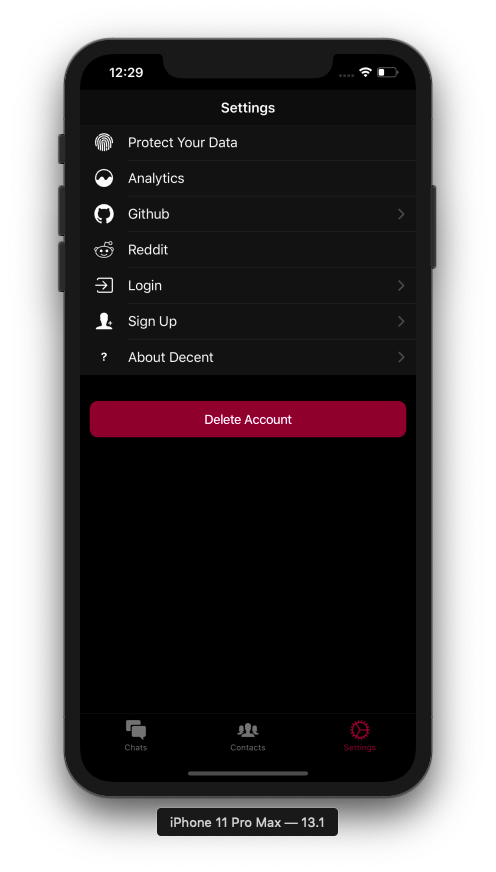
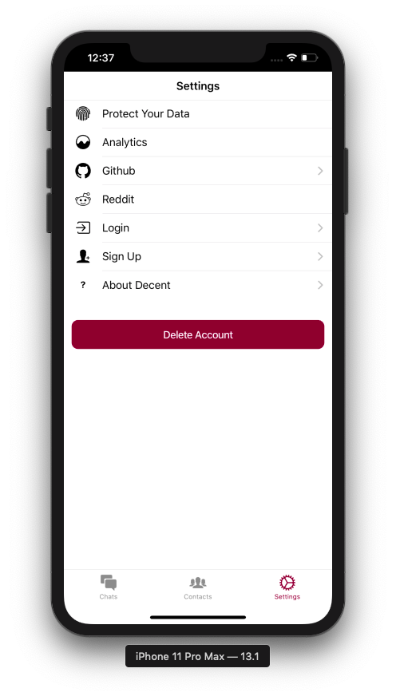
 

<h2>Slide 1</h2>

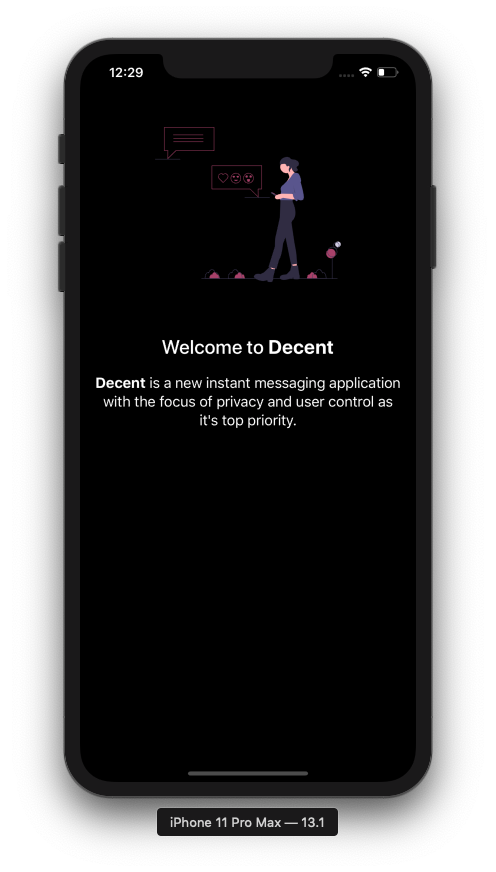
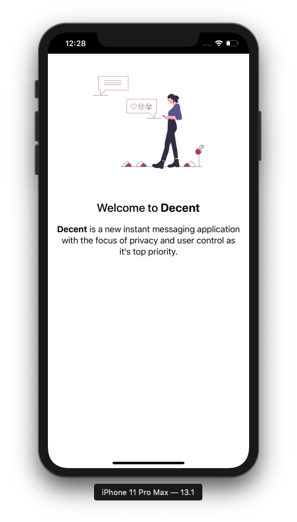
 

<h2>Slide 2</h2>

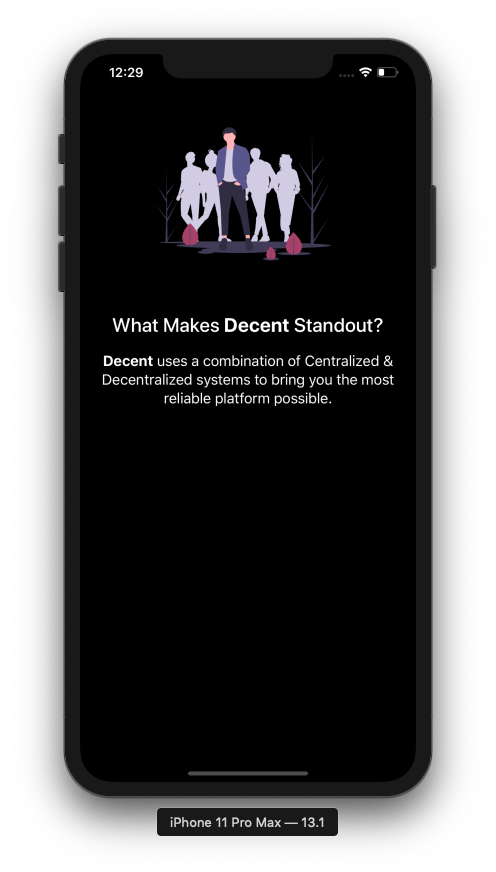
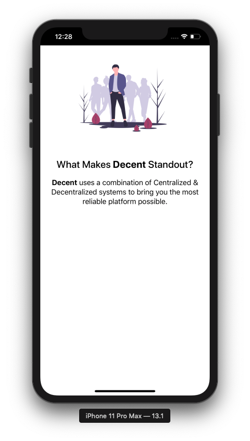
 

<h2>Slide 3</h2>

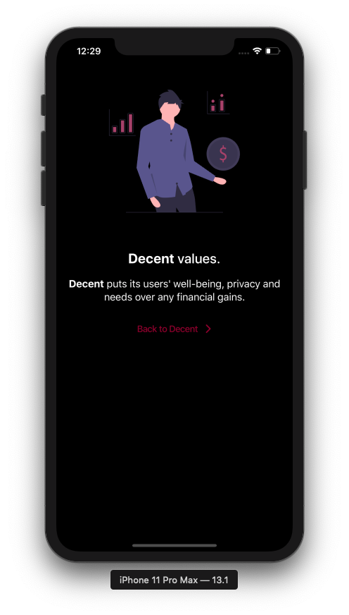
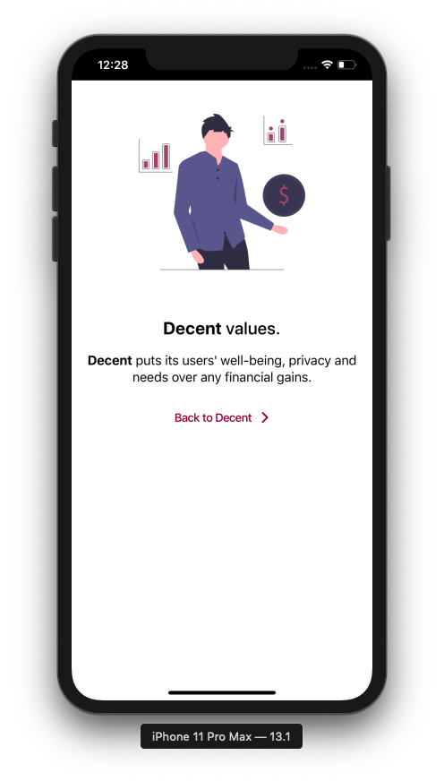
